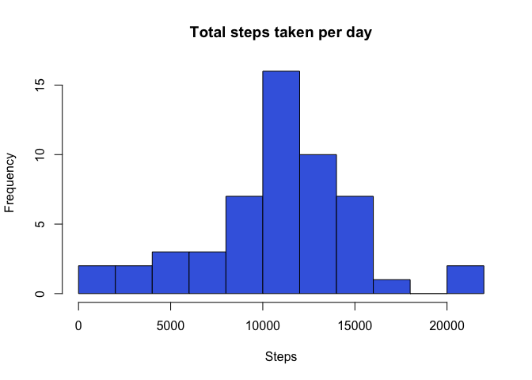
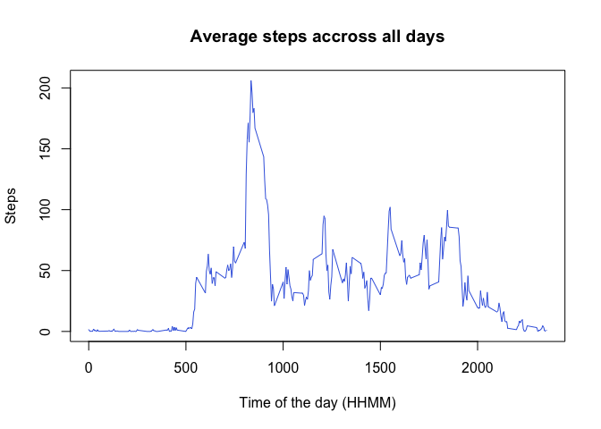
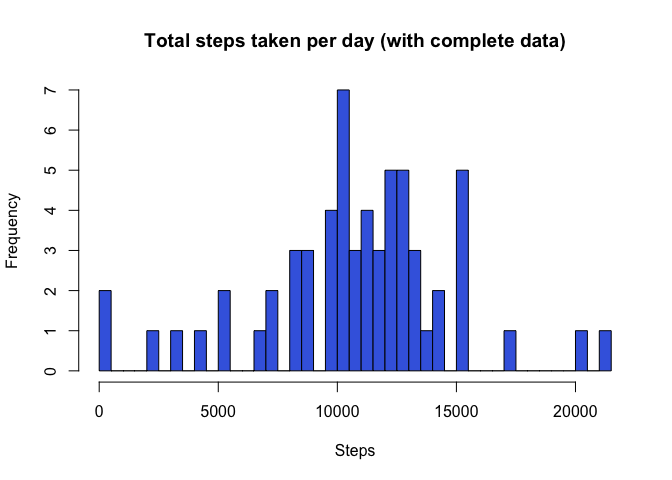
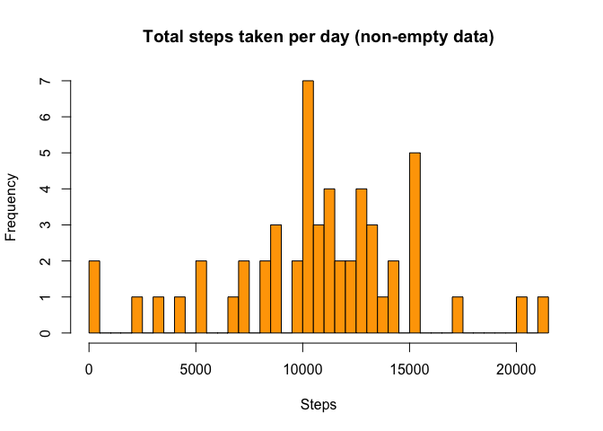
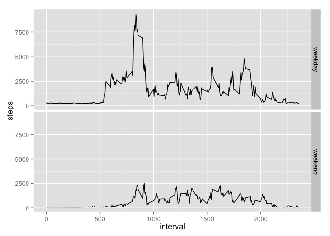

# Reproducible Research: Peer Assessment 1


## Loading and preprocessing the data


```r
unzip("activity.zip")
```

Now we have `activity.csv` ready to be read.


```r
classes <- c(steps="numeric", Date="character", interval="numeric")
data <- read.csv("activity.csv", colClasses=classes)
```

Convert the day to date format


```r
data$date <- as.Date(data$date,  '%Y-%m-%d')
```

Convert the interval coding to time format.


```r
data$intervalNumber <- paste0("000", data$interval)
data$intervalNumber <-substr(data$intervalNumber, nchar(data$intervalNumber)-3, nchar(data$intervalNumber))
```

Add a new `datetime` value.


```r
data$datetime <- strptime(paste(data$date, data$intervalNumber), '%Y-%m-%d %H%M')
```


Load libraries for data processing


```r
library(dplyr)
```

## What is mean total number of steps taken per day?

Prepare data 


```r
byDay <- select(data, date, steps) %>% group_by(date)
dailyData <- summarise(byDay, steps = sum(steps))
dailyDataNonEmpty <- subset(dailyData, !is.na(steps))
```

Histogram showing the distribution of total steps taken per day.


```r
hist(dailyDataNonEmpty$steps, xlab="Steps", main="Total steps taken per day", breaks=15, col="royalblue")
```

 


```r
meanNonEmptyData <- mean(dailyDataNonEmpty$steps)
medianNonEmptyData <- median(dailyDataNonEmpty$steps)
```

Average of steps taken each day is 10766.19

Median of steps taken each day 10765.00

## What is the average daily activity pattern?

Average of steps every 5 minutes interval (across all days).


```r
nonEmpty <- subset(data, !is.na(steps))
byInterval <- select(nonEmpty, interval, steps) %>%  group_by(interval)
intervalAvg <- summarise(byInterval, steps = mean(steps))
plot(intervalAvg$interval, intervalAvg$steps, type='l', ylab='Steps', xlab='Time of the day (HHMM)', main='Average steps accross all days', col="royalblue")
```

 

5 minute interval with the maximun average of steps.


```r
head(arrange(intervalAvg, desc(steps)),1)$interval
```

```
## [1] 835
```


## Imputing missing values

Total number of intervals in data:


```r
totalIntervalsWithoutData <- nrow(data)
totalIntervalsWithoutData
```

```
## [1] 17568
```

Intervals without data (steps = NA) (count, % over all data).


```r
intervalsWithoutData <- length(which(is.na(data$steps)))
naData <- c("NA Count"=intervalsWithoutData, "percentage Over Total"=intervalsWithoutData/totalIntervalsWithoutData*100)
```

If 13.11% is considered too high to avoid a bias by NA data could be present.

In this new dataset the missing values are replaced by the mean value for steps count for the same day of the week.


```r
dataFilled <- data %>%
              select(date, intervalNumber, interval, steps) %>%
              mutate(weekday = weekdays(date)) %>%
              group_by(weekday) %>%
              mutate(avgByDay = mean(steps, na.rm=TRUE)) %>%
              mutate(steps = ifelse(is.na(steps), avgByDay, steps)) %>%
              ungroup()
```

Summarise by day


```r
filledDailyData <- summarise(group_by(dataFilled, date), steps = sum(steps))
```

Histogram showing the distribution of total steps taken per day.


```r
hist(filledDailyData$steps, xlab="Steps", main="Total steps taken per day (with complete data)", breaks=32, col="royalblue")
```

 

```r
hist(dailyDataNonEmpty$steps, xlab="Steps", main="Total steps taken per day (non-empty data)", breaks=32, col="orange")
```

 


```r
meanFilledData <- mean(filledDailyData$steps)
medianFilledData <- median(filledDailyData$steps)
diffMean <- meanFilledData - meanNonEmptyData
diffMedian <- medianFilledData - medianNonEmptyData
```

Average of steps taken each day: 10821.21

Difference with the mean of dataset when empty data was removed: 55.02

Median of steps taken each day: 11015.00

Difference with the median of dataset when empty data was removed: 250.00

## Are there differences in activity patterns between weekdays and weekends?

Use the ggplot library to compare graphics


```r
library(ggplot2)
```

Discriminate weekends in data


```r
dataByDayKind <- dataFilled %>%
              mutate(dayKind = ifelse(weekday == "Saturday" | weekday == "Sunday", "weekend", "weekday"))
dataByDayKind$dayKind = as.factor(dataByDayKind$dayKind)
```

Compare the activity by intervals in weekdays versus weekends


```r
dayKindAvg <- summarise(group_by(dataByDayKind, dayKind, interval), steps = sum(steps))

qplot(interval, steps, data = dayKindAvg, geom = "line") + facet_grid(dayKind ~  .)
```

 

